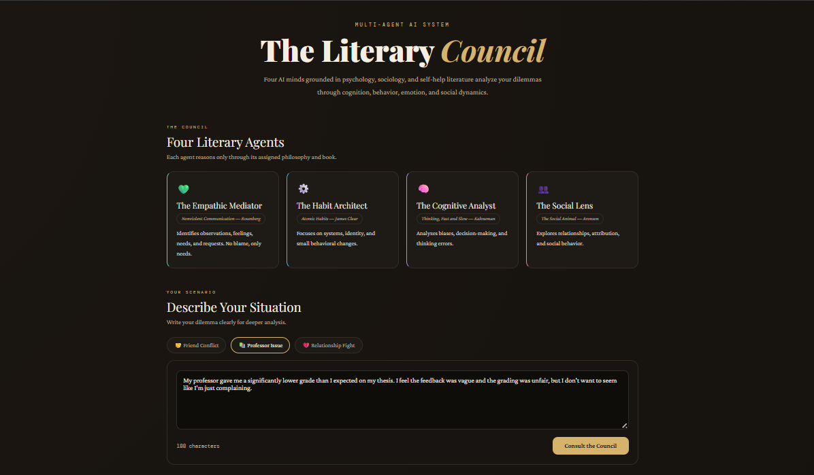

# 📚 Literary Council — Multi-Agent Philosophical Advisor

A multi-agent AI system that analyzes interpersonal scenarios through the lens of four distinct intellectual frameworks, then synthesizes their perspectives into unified, actionable wisdom.



---

## What It Does

You describe a real-life situation — a conflict with a friend, an unfair grade, a misunderstanding with your partner — and the Literary Council convenes four specialized AI agents, each grounded in a different book or discipline. They analyze your scenario in parallel, then a synthesizer distills their insights into a final recommendation.

---

## Agents

| Agent | Framework | Focus |
|---|---|---|
| 💚 **The Empathic Mediator** | *Nonviolent Communication* — Marshall Rosenberg | Observations, feelings, needs, requests |
| ⚙️ **The Habit Architect** | *Atomic Habits* — James Clear | Behavioral patterns, identity, small changes |
| 🧠 **The Cognitive Analyst** | *Thinking, Fast and Slow* — Daniel Kahneman | Cognitive biases, System 1 vs System 2 thinking |
| 👥 **The Social Lens** | *The Social Animal* — Elliot Aronson | Social perception, attribution theory, group dynamics |

After all four agents respond, a **Synthesizer** identifies convergence, productive tensions, and delivers a final integrated recommendation.
---

## Architecture

```
User Scenario
      │
      ▼
 FastAPI Backend
      │
      ├──▶ Agent 1 (NVC)        ─┐
      ├──▶ Agent 2 (Atomic)     ─┤  Parallel via asyncio
      ├──▶ Agent 3 (Kahneman)   ─┤  Streamed via SSE
      └──▶ Agent 4 (Aronson)    ─┘
                                  │
                                  ▼
                            Synthesizer
                                  │
                                  ▼
                          Final Recommendation
```

- **Frontend** receives results progressively via **Server-Sent Events (SSE)** — each agent card updates as it finishes, no waiting for all four.
- **LangGraph** manages the parallel fan-out and state aggregation across agents.
- **Gemini** (via Google GenAI SDK) powers all agents and the synthesizer.

---

## Project Structure

```
literary-council/
├── main.py                  # FastAPI app, SSE streaming, Gemini calls
├── agents/
│   └── graph.py             # LangGraph graph, agent definitions, state types
├── static/
│   ├── index.html           # Frontend UI
│   └── script.js            # SSE handling, card rendering, UI logic
├── .env                     # API keys (not committed)
├── requirements.txt
└── README.md
```

---

## Setup

### 1. Clone and install

```bash
git clone https://github.com/somaiaahmed/literary-council.git
cd literary-council
pip install -r requirements.txt
```

### 2. Configure environment

Create a `.env` file in the project root:

```env
GEMINI_API_KEY=your_google_gemini_api_key_here
```

Get your key at [Google AI Studio](https://aistudio.google.com/).

### 3. Run

```bash
uvicorn main:app --reload
```

Then open [http://localhost:8000](http://localhost:8000) in your browser.

---

## API Endpoints

| Method | Endpoint | Description |
|---|---|---|
| `GET` | `/` | Serves the frontend |
| `POST` | `/analyze` | Runs the council; streams results via SSE |
| `GET` | `/agents` | Returns public agent metadata (no system prompts) |
| `GET` | `/health` | Health check |

### `/analyze` request body

```json
{
  "scenario": "My friend says I've been distant lately...",
  "mode": "multi"
}
```

### SSE event types emitted

| Event | Payload | When |
|---|---|---|
| `init` | `{ agents: [...] }` | Immediately — lets UI build skeleton cards |
| `agent_result` | `{ agent_key, agent_name, book, content, ... }` | As each agent finishes |
| `synthesis` | `{ content }` | After all agents complete |
| `done` | `{}` | Stream complete |

---

## Adding a New Agent

1. Add a new entry to `AGENT_DEFINITIONS` in `agents/graph.py`:

```python
{
    "key":   "stoic",
    "name":  "The Stoic Counselor",
    "book":  "Meditations — Marcus Aurelius",
    "color": "#8b7355",
    "icon":  "🏛️",
    "system_prompt": """You are based on Stoic philosophy...."""
}
```

2. That's it — the graph fans out to all agents automatically.

---

## Requirements

- Python 3.10+
- `fastapi`
- `uvicorn`
- `langgraph`
- `google-genai`
- `python-dotenv`
- `pydantic`

---

## Key Design Decisions

**Why SSE over WebSockets?** SSE is simpler for one-directional server-to-client streaming and works seamlessly with `StreamingResponse` in FastAPI. Since the client only sends one request and then listens, SSE is the right fit.

**Why LangGraph?** The fan-out pattern (one input → many parallel agents → aggregated state) maps cleanly onto LangGraph's `Send()` API. It also makes adding new agents or chaining agents trivial.

**Why hide system prompts?** `get_agent_definitions()` strips `system_prompt` before sending agent metadata to the frontend, keeping the prompts server-side only.

---

## License

MIT